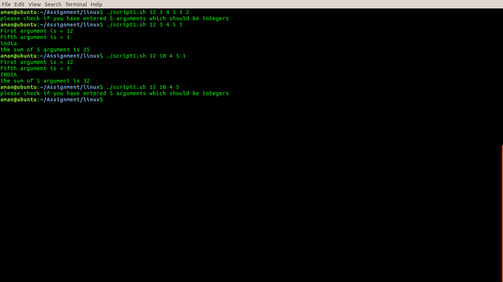
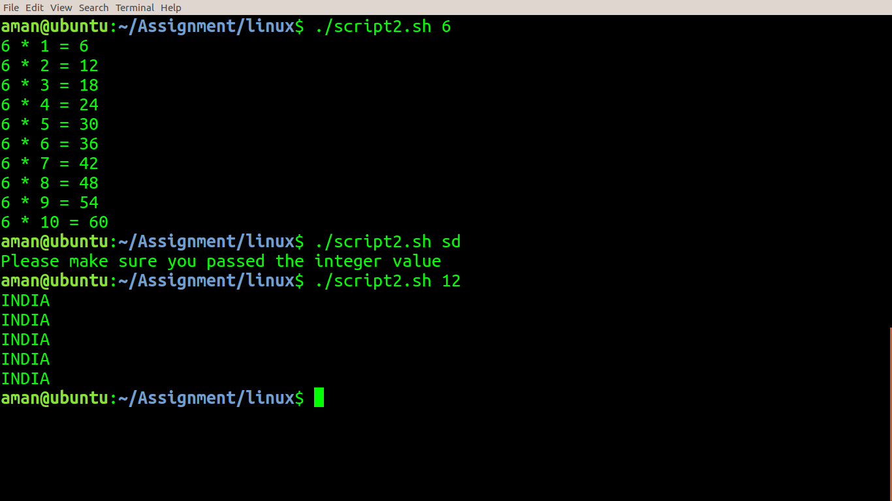
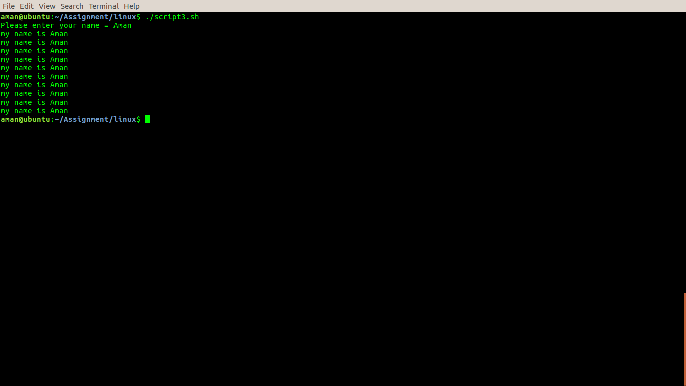
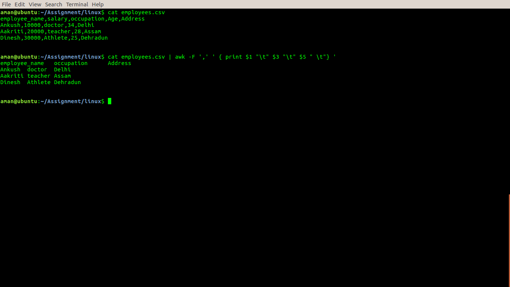

# TASK1 Read and make doc  about these topics
* *sed* - you can find the doc in this topics here - [Sed_documentation](doc/sed.txt )
* *awk*-you can find the doc in this topics here - [Awk_documentation](doc/awk.txt )

* *shebang* - you can find the doc in this topics here - [Shebang_documentation](doc/shebang.txt )

* *exit status* - you can find the doc in this topics here - [Exit_documentation](doc/exit_status.txt )


# TASK2  Make a script and pass 5 command line arguments(arguments value should be interger)

    - print 1st and 5th command line arguments
    -  print "INDIA" if 2nd argument equal to 10 else it will print "india"
    - print addition of all arguments

```
#!/bin/bash
if [ $# -eq 5 ];
then
echo -e "First argument is = $1 \nFifth argument is = $5"
if [ $2 -eq 10 ];
then
echo "INDIA"
else
echo "india"
fi
sum=$(echo "$1+$2+$3+$4+$5" | bc)
echo "the sum of 5 argument is $sum"
else
echo "please check if you have entered 5 arguments which should be integers"
fi     
``` 



# TASK3 Make a script and pass one command line arguments(use loop)

    - print the table of command line argument if value is less 10
    - print 5 times "INDIA" if value is greater than or equal to 10
```
 #!/bin/bash
 if ! [[ $1 =~ ^[0-9]+$ ]];
  then
   echo "Please make sure you passed the integer value"
   exit 1;
  fi
 if [ $1 -lt 10 ];
 then
 for i in {1..10}
 do
 mul=$(echo "$i*$1" | bc )
 echo "$1 * $i = $mul"
 done
 else
 for i in {1..5}
 do
 echo "INDIA"
 done
 fi
```




# TASK4 Make a script and print your name 10 times(use fuction to print your name)
```
#!/bin/bash
print_name()
{
for i in {1..10}
do
echo "Your name is $1 "
done
}
read -p "Please enter your name = " name

print_name $name
```


# TASK5 Make a excel sheet manually with 5 column, and print the 1st,3rd and 5th column


```
$cat employees.csv 
employee_name,salary,occupation,Age,Address
Ankush,10000,doctor,34,Delhi
Aakriti,20000,teacher,28,Assam
Dinesh,30000,Athlete,25,Dehradun


$cat employees.csv | awk -F ',' ' { print $1 "\t" $3 "\t" $5 " \t"} '
employee_name	occupation	Address 	
Ankush	doctor	Delhi 	
Aakriti	teacher	Assam 	
Dinesh	Athlete	Dehradun
```


# TASK6 Install the zabbix-agent using shell script
```
#!/bin/bash

sudo apt-get update
sudo apt-get install zabbix-agent -y
sudo systemctl start zabbix-agent
sudo sed -i 's/Server=127.0.0.1/Server=zabbix.opstree.com/' /etc/zabbix/zabbix_agentd.conf
sudo sed -i 's/Hostname=Zabbix/Hostname=192.168.1.11-zabbixagent/' /etc/zabbix/zabbix_agentd.conf
sudo service zabbix-agent restart

```


# TASK7 Make a script in which you will pass a git repo path and it will generate a html report of last 5 days commits

