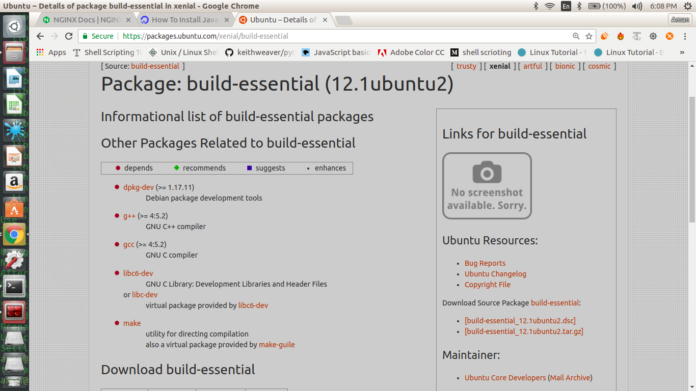

TASK1
 Install and configure apache/httpd
- sudo apt-get install apache2       //install Apache in ubuntu
- whereis apache2                    //shows the location of the needed file to execute Apache

TASK2
Install and configure nginx - configure it to run as reverse proxy to apache

STEP1 -
- sudo apt-get install nginx                      // to install the nginx 
- whereis nginx                                       //  to see the location of the files to execute nginx. For ex-
                                                                    configuration file,libraries etc

STEP 2     
                                       
Change the port for the apache server to 8085 in ports.conf file

   -  sudo vi /etc/apache2/ports.conf

   -  add port number using this line in file for ex-  Listen 8085

After modifying the file restart apache using command 
 
    -sudo systemctl restart apache2

Step3
Now using Nginx as reverse proxy for apache
-  sudo vi /etc/nginx/sites-avaible/default
-  by giving the server_ip and port and at which apache2 is running by adding this line
   location /{
       proxy_pass http://localhost:8085         // proxy_pass  http://server_ip:port of the backend   
                                                                        server
         }

Step4
Edit index.html using
- sudo vi /var/www/html/index.html
  write Hi, I’m Devops Ninja in body of html page 

After doing all of the above process restart nginx and apache
-  sudo systemctl restart nginx
-  sudo systemctl restart apache2
And open your browser and type localhost  and you can see here nginx as a reverse proxy for apache 

TASK3
Install and configure 'ntp' - with singapore time zone
- sudo timedatectl set-timezone Asia/Singapore 
- sudo timedatectl set-ntp no
- sudo apt-get install ntp
- timedatectl

TASK4
Install Tomcat version 8
- sudo apt-get install tomcat8

Brief explaination about the it's directories 

Tomcat is an application server from the Apache software Foundation that executes Java servlets and renders Web pages that JSP conding.It is open collaboration of developers and is avaible from the Apache web site in both binary and source versions.
Tomcat requires Java Runtime Enterprise Environment 
Tomcat's root address is basically set in environment variable in CATALINA_HOME
Important Directory of the tomcat
1) bin directory is where its stores start,stop and other scripts
2) Configuration files
   - server.xml which is situated in $CATALINA_HOME/conf/server.xml. server.xml file is Tomcat's main configuration file, and is responsible for specifying Tomcat's initial configuration on startup as well as defining the way and order in which Tomcat boots and builds. The elements of the server.xml file belong to five basic categories - Top Level Elements, Connectors, Containers, Nested Components, and Global Settings. All of the elements within these categories have many attributes that can be used to fine-tune their functionality. Most often, if you need to make any major changes to your Tomcat installation, such as specifying application port numbers, server.xml is the file to edit.

   - web.xml The web.xml file is derived from the Servlet specification, and contains information used to deploy and configure the components of your web applications. When configuring Tomcat for the first time, this is where you can define servlet mappings for central components such as JSP. Within Tomcat, this file functions in the same way as described in the Servlet specification. The only divergence in Tomcat's handling of this file is that a user has the option of utilizing TOMCAT-HOME/conf/web.xml to define default values for all contexts. If this method is utilized, Tomcat will use TOMCAT-HOME/conf/web.xml as a base configuration, which can be overwritten by application-specific WEB-INF/web.xml files.

   - tomcat-user.xml Default lists of roles, users, and passwords that Tomcat's UserDatabaseRealm will use for authentication can be found in tomcat-users.xml.If you want to access any of the administrative tools that are packaged with Tomcat, you can edit this file to add admin and manager access.
3) webapps
   Here we store our webapps to execute it.

4) Logs 
   these files is here by default

   TOMCAT RUNNING at port 9090 as some other service was using port 8080 so i changed it to 9090 by modifying server.xml
 

TASK5
 Install java version 8 with home directory set as an environment variable
Step1-
sudo add-apt-repository ppa:webupd8team/java  //adding the oracle's package manager    

sudo apt-get update                            //updating the package manager
           
  
sudo apt-get install oracle-java8-installer
                      

checking the version of java

Setting the environment variable for java
export JAVA_HOME=/usr/lib/jvm/java-8-oracle

TASK6
Install 'build essentials' 
sudo apt-get install build-essential

why do we need build essentials
The build-essentials package is a reference for all the packages needed to compile a Debian package. It generally includes the GCC/g++ compilers and libraries and some other utilities

TASK7
Install logrotate and rotate tomcat's catalina.out log as:
rotate the log file after 500kb
keep only last 5 files

- first install logrotate as its already install in ubuntu16.04 so we do have to install it
- Now go to the /etc/logrotate.d/
- create the tomcat name file and edit it . for ex- vi tomcat
- give the path of the file of which the logs are to be rotate 
- inside it write the following whatever is written in the image
  

TASK8
Make a directory as '/ninja' having one file inside with name 'devops' and share it via nfs & then mount the same on '/mnt'

TASK9
Install git 
sudo apt-get install git

what it is and why do we need it?

TASK10
After installing above check the respective logs if everything is installed and running.

TASK11
Also mention other files got created with software installation
[tomcat_document](tomcat_doc)

 

