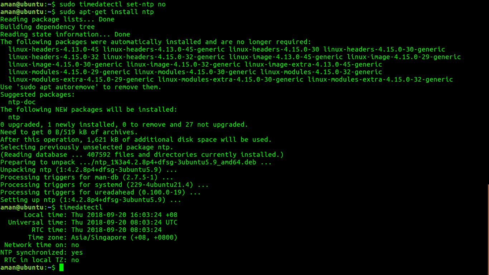

#TASK1 Install and configure apache/httpd
 -sudo apt-get install apache2                                                           //install Apache in ubuntu
 -whereis apache2                                                                       //shows the location of the needed file to execute Apache

#TASK2  Install and configure nginx - configure it to run as reverse proxy to apache

##STEP1 
 -sudo apt-get install nginx                                                          // to install the nginx 
 -whereis nginx                                                                       // to see the location of the files to execute nginx. For ex-configuration file,libraries etc

##STEP 2     
                                       
Change the port for the apache server to 8085 in ports.conf file

   -sudo vi /etc/apache2/ports.conf

   - add port number using this line in file for ex-  Listen 8085

After modifying the file restart apache using command 
 
    -sudo systemctl restart apache2

##Step3

Now using Nginx as reverse proxy for apache
 -sudo vi /etc/nginx/sites-avaible/default
- by giving the server_ip and port and at which apache2 is running by adding this line
   location /{
       proxy_pass http://localhost:8085         // proxy_pass  http://server_ip:port of the backend   
                                                                        server
         }

##Step4

Edit index.html using
 -sudo vi /var/www/html/index.html
  write Hi, I’m Devops Ninja in body of html page 

After doing all of the above process restart nginx and apache
  -sudo systemctl restart nginx
  -sudo systemctl restart apache2
And open your browser and type localhost  and you can see here nginx as a reverse proxy for apache 

#TASK3
Install and configure 'ntp' - with singapore time zone
 -sudo timedatectl set-timezone Asia/Singapore 
 -sudo timedatectl set-ntp no
 -sudo apt-get install ntp
 -timedatectl

#TASK4
Install Tomcat version 8

 -sudo apt-get install tomcat8

TOMCAT RUNNING at port 9090 as some other service was using port 8080 so i changed it to 9090 by modifying server.xml
 

Here is the brief introduction about tomcat- [tomcat_doc](doc/tomcat.txt)

TASK5
 Install java version 8 with home directory set as an environment variable
Step1-
 -sudo add-apt-repository ppa:webupd8team/java  //adding the oracle's package manager    

 -sudo apt-get update                            //updating the package manager

           
  
 -sudo apt-get install oracle-java8-installer

                      

checking the version of java

Setting the environment variable for java
export JAVA_HOME=/usr/lib/jvm/java-8-oracle

TASK6
Install 'build essentials' 
 -sudo apt-get install build-essential

why do we need build essentials?
Here is the doc - [build_essential](doc/build_essential.txt)
Install logrotate and rotate tomcat's catalina.out log as:
rotate the log file after 500kb
keep only last 5 files

- first install logrotate as its already install in ubuntu16.04 so we do have to install it
- Now go to the /etc/logrotate.d/
- create the tomcat name file and edit it . for ex- vi tomcat
- give the path of the file of which the logs are to be rotate 
- inside it write the following whatever is written in the image
  

#TASK8
Make a directory as '/ninja' having one file inside with name 'devops' and share it via nfs & then mount the same on '/mnt'

#TASK9
Install git 
sudo apt-get install git

What it is and why do we need it?
Brief introduction about git - [git](doc/git.txt)

#TASK10
After installing above check the respective logs if everything is installed and running.

 

